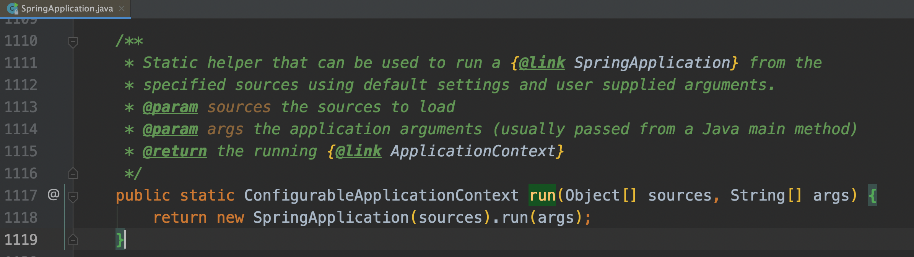
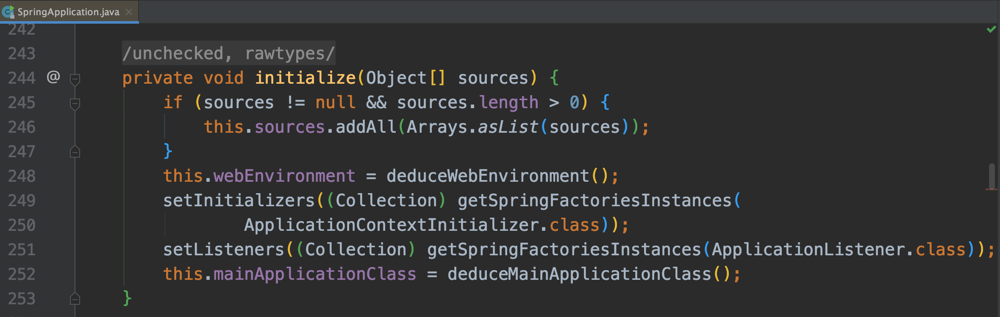
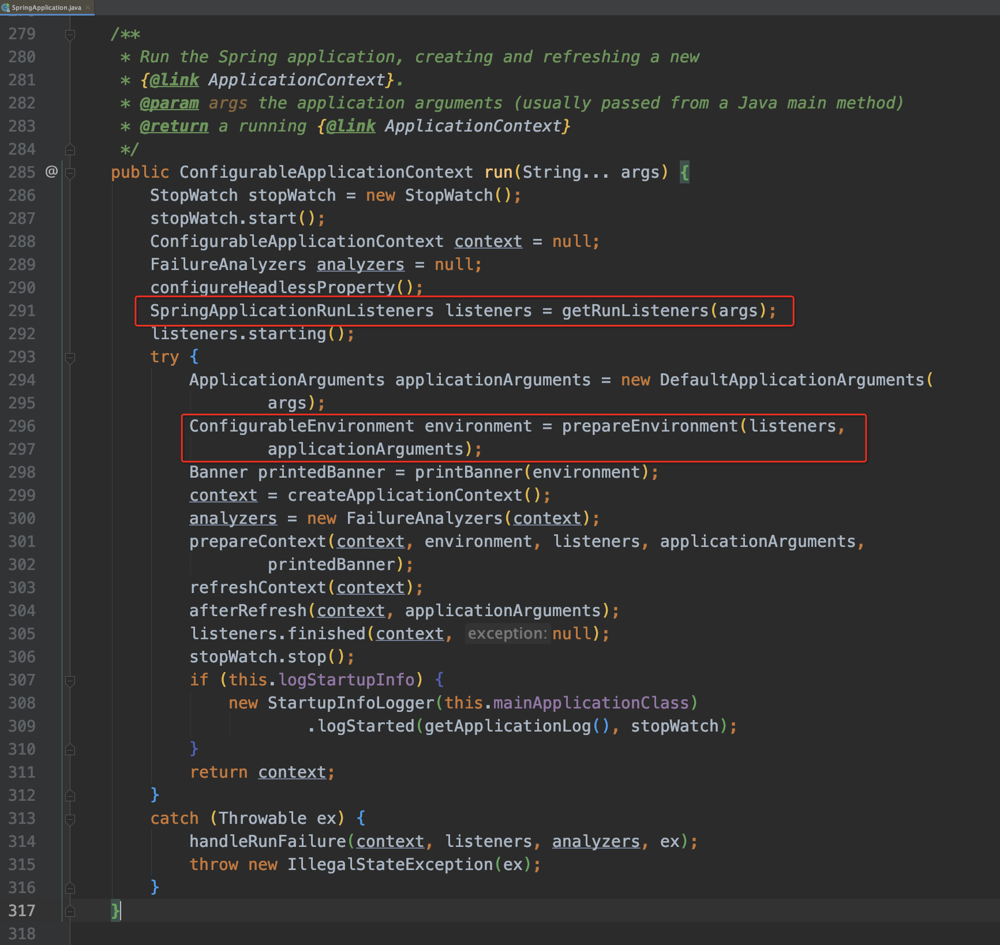

本文分析的springboot版本为
```
<groupId>org.springframework.boot</groupId>
<artifactId>spring-boot</artifactId>
<version>1.5.8.RELEASE</version>
```
springboot应用的启动入口是org.springframework.boot.SpringApplication#run(java.lang.Object[], java.lang.String[])


# SpringApplication的实例化初始化

主要是设置ApplicationContextInitializer和ApplicationListener，都是通过SpringFactoriesLoader加载的;

# 执行springApplication.run方法

## 1.加载SpringApplicationRunListener
通过SpringFactoriesLoader加载，默认加载的实例是EventPublishingRunListener;
再通过EventPublishingRunListener广播ApplicationStartedEvent事件; 匹配的ApplicationListener进行同步订阅执行;
