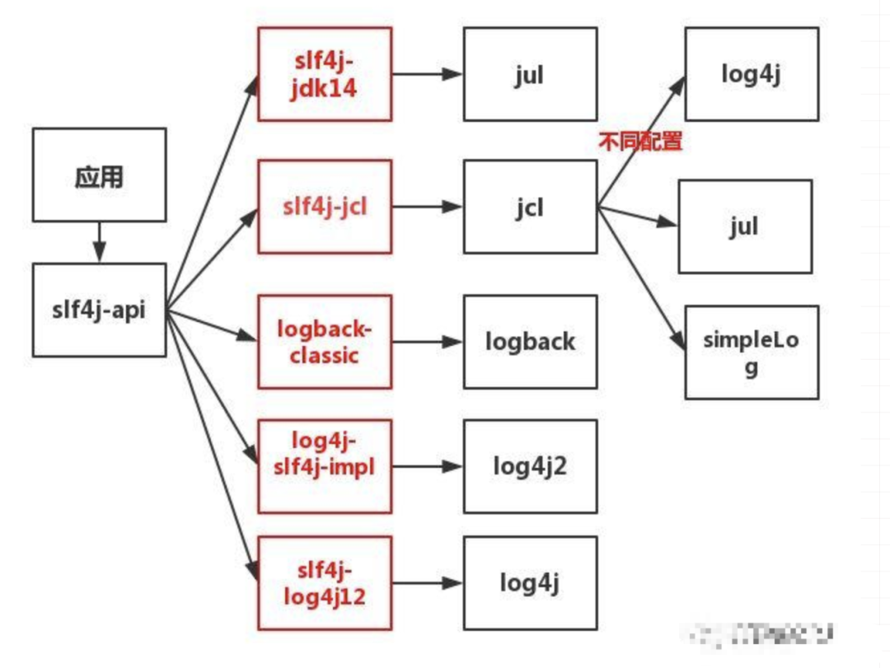
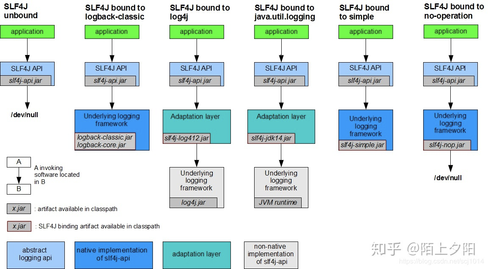
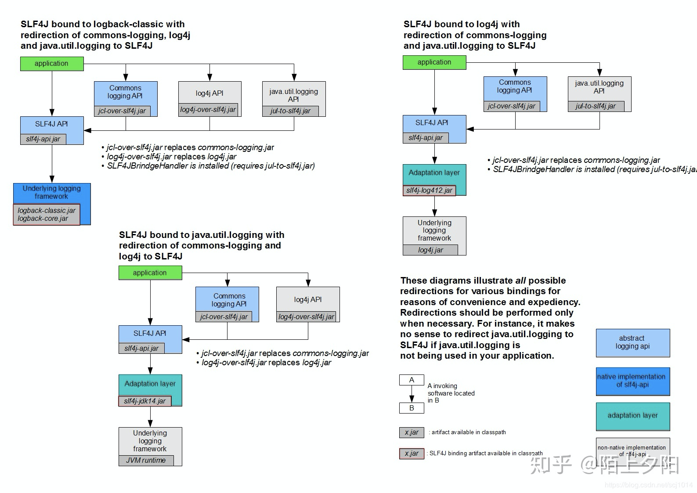
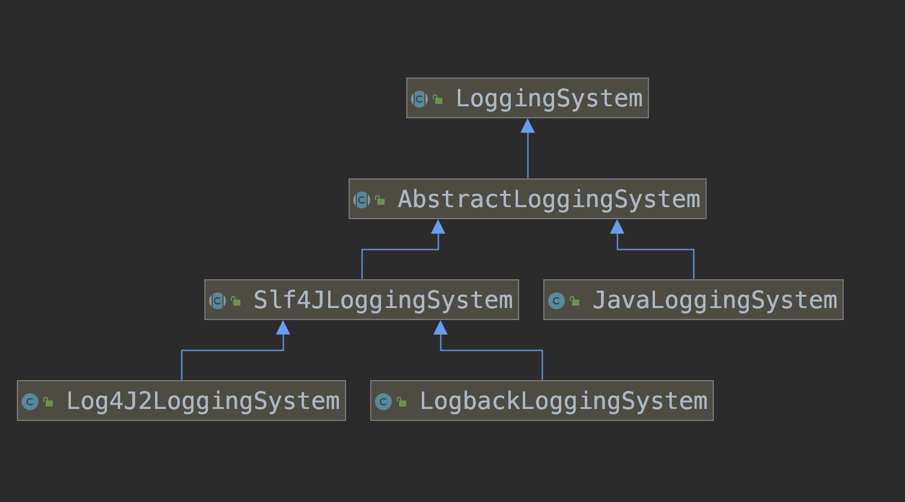
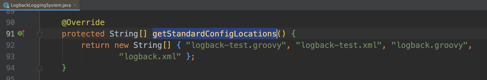
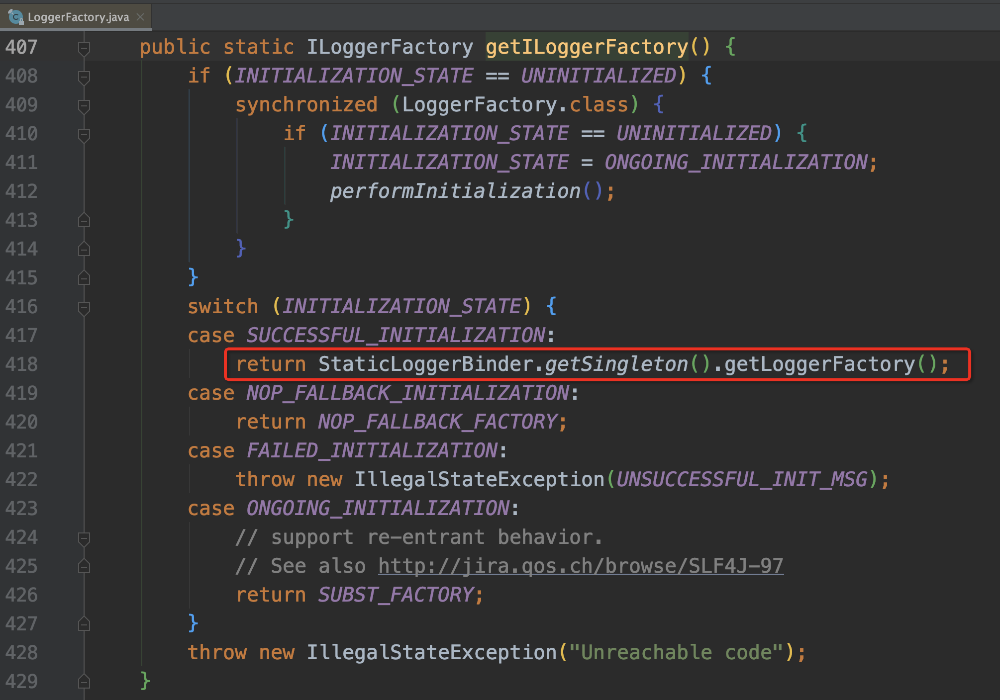

# 日志概述
- 日志的目的
1.排查问题
2.监测系统，评估系统运行情况
3.打日志也是很有讲究的，良好的日志输出习惯，事半功倍
- 打日志的影响
1.非有效业务代码增加，代码变臃肿
2.降低性能
- 日志输出方式
	1.输出日志至控制台
	但在大多数情况下app会后台启动，会把控制台标准输出和错误输出重定向至日志文件
	```
	nohup java -jar ./xxx.jar >/dev/null 2>&1 &
	```
	2.输出日志至文件

# 日志门面+日志实现框架
### 日志门面
可以简单理解为定义了一套客户端打日志的调用标准，通过接口来表示，不关心具体的实现；日志门面带来的好处是，切换底层的日志实现框架，客户端可以不用修改代码，将日志打印逻辑与具体的日志实现之间解耦；常见的日志门面，
- 1.commons-logging
	```
	<dependency>
	<groupId>commons-logging</groupId>
  <artifactId>commons-logging</artifactId>
	<dependency>
	```
	日志接口:org.apache.commons.logging.Log
	工厂接口:org.apache.commons.logging.LogFactory
- 2.slf4j
	```
	<dependency>
	<groupId>org.slf4j</groupId>
  <artifactId>slf4j-api</artifactId>
	<dependency>
	```
	日志接口:org.slf4j.Logger
	工厂接口:org.slf4j.ILoggerFactory
	工厂总门面:org.slf4j.LoggerFactory
### 日志实现框架

负责最终的具体的日志打印，比如
log4j(org.apache.log4j.Logger)、log4j2(org.apache.logging.log4j.Logger)、logback(ch.qos.logback.classic.Logger)、
jul(java.util.logging.Logger);
- commons-logging支持log4j\jul\SimpleLog;
- Slf4J支持log4j2\logback;
- 也可以通过拓展包，相互进行适配
	- slf4j门面适配不同的日志实现框架，通过适配器，jul和log4j也能使用slf4j门面
	
	- slf4j重定向至其他日志门面或框架，通过适配器，业务代码通过不同的日志门面打日志，最终都是采用同一个日志框架(比如logback)输出统一的日志格式；
	
# SpringBoot使用的日志框架


### LoggingSystem
属于SpringBoot的日志标准，支持的日志框架

包括java自带和Slf4J两个标准
- LogbackLoggingSystem
logback日志框架
配置文件位置，"logback-test.groovy", "logback-test.xml", "logback.groovy", "logback.xml"
以及-spring后缀的;

- Log4J2LoggingSystem
log4j2日志框架
配置文件，"log4j2.yaml", "log4j2.yml"

- JavaLoggingSystem
java.util.logging日志框架
配置文件位置，logging.properties

### LoggingSystem加载过程
以logback框架为例分析，在spring容器启动阶段
- org.springframework.boot.logging.LoggingApplicationListener#onApplicationEvent监听ApplicationStartingEvent事件，确定并实例化使用哪种类型的LoggingSystem，默认是LogbackLoggingSystem。

- 监听ApplicationEnvironmentPreparedEvent事件，初始化LogbackLoggingSystem，加载logback.xml配置文件，初始化LogbackContext，并执行静态绑定StaticLoggerBinder;


- 静态绑定后，业务代码中org.slf4j.LoggerFactory#getLogger(java.lang.String)获取的Logger，都是采用绑定的LogbackContext;

