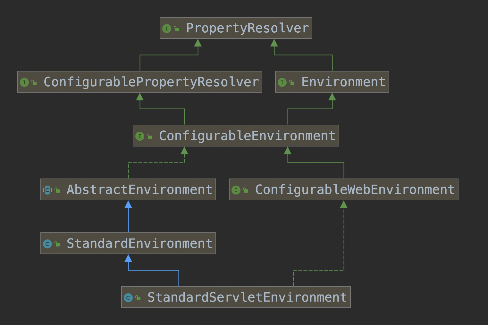
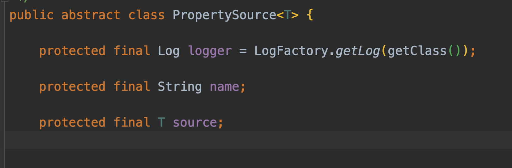
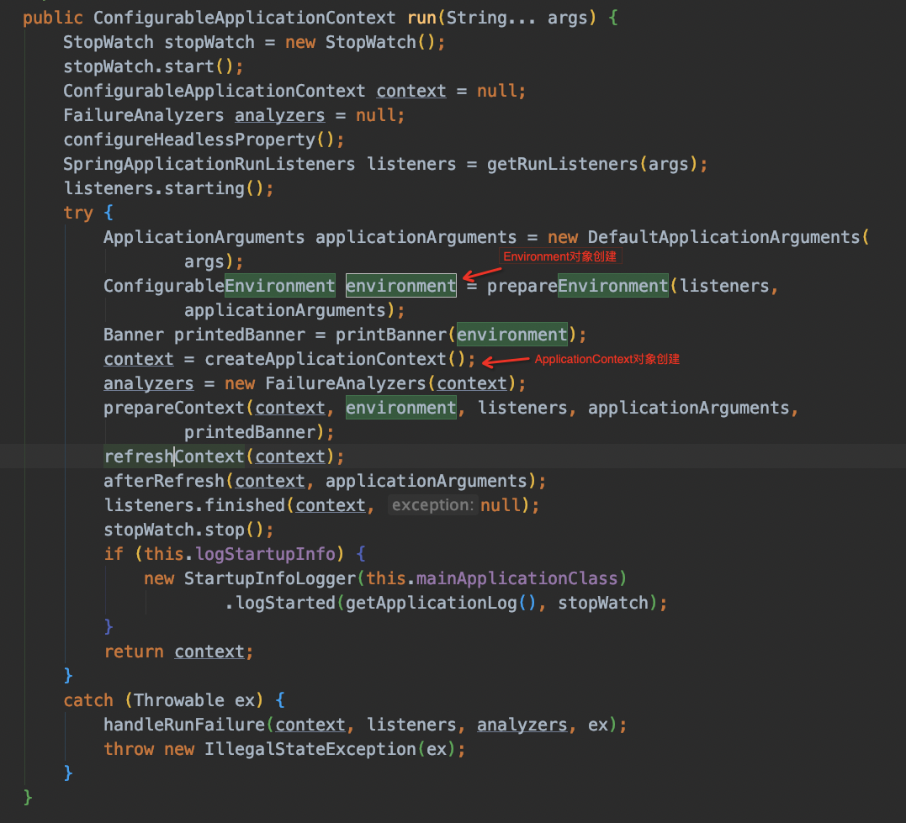

# Properties的配置
- @Configuration + @PropertySource("classpath:xxxx")
- @Bean + PropertySourcesPlaceholderConfigurer
- @Bean + PropertyPlaceholderConfigurer（已过时）
- springboot应用，默认加载application.properties和application-{env}.properties

# Properties获取
- @Value
- 通过org.springframework.core.env.Environment获取
env.getProperty()
- @Component + @ConfigurationProperties(prefix="xxx")，自动填充

# Properties加载

## Properties的存储
spring应用的配置项是由org.springframework.core.env.Environment维护的，web应用是org.springframework.web.context.support.StandardServletEnvironment类型，类继承结构如下，主要维护properties和profile信息;



- properties信息具体是由AbstractEnvironment的propertySources对象字段维护
`
private final MutablePropertySources propertySources = new MutablePropertySources(this.logger);
`

- MutablePropertySources是聚合多个来源的Properties，持有List对象
`
private final List<PropertySource<?>> propertySourceList = new CopyOnWriteArrayList<PropertySource<?>>();//并发安全
`
- PropertySource表示某一特定来源的配置，
常见实现类
	- org.springframework.core.env.MapPropertySource, map类型存储
	- org.springframework.core.env.CompositePropertySource，可以把相同来源的PropertySource组合在一起
	- org.springframework.core.env.SystemEnvironmentPropertySource，系统环境变量
	- org.springframework.core.env.SimpleCommandLinePropertySource，jvm启动参数

## Properties的拓展
- PropertySource加载过程
Environment先于IOC容器ApplicationContext创建，但PropertySource的加载贯穿应用整个启动过程

```sequence
MyApplication -> SpringApplication: 应用main入口\nSpringApplication.run调用

SpringApplication->SpringApplication:0.initialize\n0.1.加载ApplicationContextInitializer\n0.2.加载ApplicationListener\n
SpringApplication->SpringApplication:加载SpringApplicationRunListener\nlisteners.starting

SpringApplication->SpringApplication:1.prepareEnvironment\n1.1.getOrCreateEnvironment//实例化Environment对象,add PropertySource="systemProperties","SystemEnvironment"\n1.2.configureEnvironment//初始化\n1.2.1.configurePropertySources\n1.2.1.1.add PropertySource="defaultProperties"\n1.2.1.2.add PropertySource="commandLineArgs"\n1.2.2.configureProfiles//设置profile\n1.3.listeners.environmentPrepared

SpringApplication->EventPublishingRunListener:
EventPublishingRunListener->SimpleApplicationEventMulticaster:,广播ApplicationEnvironmentPreparedEvent
SimpleApplicationEventMulticaster->SimpleApplicationEventMulticaster:加载所有匹配的ApplicationListener
SimpleApplicationEventMulticaster->SimpleApplicationEventMulticaster:轮询调用ApplicationListener#onApplicationEvent\n其中用于Property处理的是ConfigFileApplicationListener
SimpleApplicationEventMulticaster->ConfigFileApplicationListener:
ConfigFileApplicationListener->ConfigFileApplicationListener:通过SpringFactoriesLoader加载所有EnvironmentPostProcessor
ConfigFileApplicationListener->ConfigFileApplicationListener:轮询调EnvironmentPostProcessor#postProcessEnvironment\n其中ConfigFileApplicationListener本身就是EnvironmentPostProcessor类型
ConfigFileApplicationListener->ConfigFileApplicationListener:postProcessEnvironment处理\n add PropertySource="random"
ConfigFileApplicationListener->ConfigFileApplicationListener.Loader:add PropertySource="applicationConfigurationProperties"
ConfigFileApplicationListener.Loader->ConfigFileApplicationListener.Loader: 查询classpath:/,classpath:/config/,file:./,file:./config/目录下{spring.config.name}-{profile}.properties文件\n默认文件application-{profile}.properties


ConfigFileApplicationListener->ConfigFileApplicationListener:依次调用其他的EnvironmentPostProcessor\n比如自定义的DiamondEnvironmentPostProcessor
ConfigFileApplicationListener->DiamondEnvironmentPostProcessor:
DiamondEnvironmentPostProcessor->DiamondEnvironmentPostProcessor:add PropertySource="diamondProperties"
DiamondEnvironmentPostProcessor->ConfigFileApplicationListener:
ConfigFileApplicationListener->SimpleApplicationEventMulticaster:
SimpleApplicationEventMulticaster->EventPublishingRunListener:
EventPublishingRunListener->SpringApplication:
SpringApplication->SpringApplication:createApplicationContext//实例化ApplicationContext
SpringApplication->SpringApplication:prepareContext,setEnvironment
SpringApplication->SpringApplication:refreshContext//IOC容器初刷新启动,另开文章详讲
SpringApplication->SpringApplication:afterRefresh
SpringApplication->SpringApplication:listeners.finished
```

- 拓展方式
按放入Environment先后顺序
	- 在spring.factories自定义org.springframework.boot.env.EnvironmentPostProcessor，加载自定义的配置项，并放入Environment，保证在IOC容器实例化前就已完成;
	- 在BeanDefinition注册期自定义配置项,比如@Import
	- 在BeanDefinition的拓展期，比如BeanFactoryPostProcessor,
