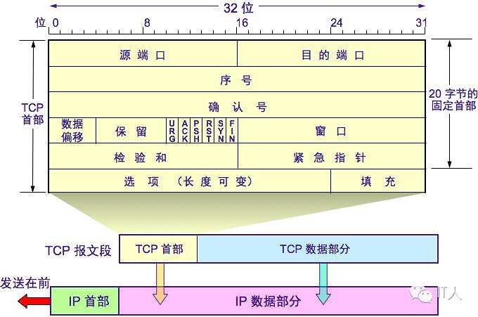
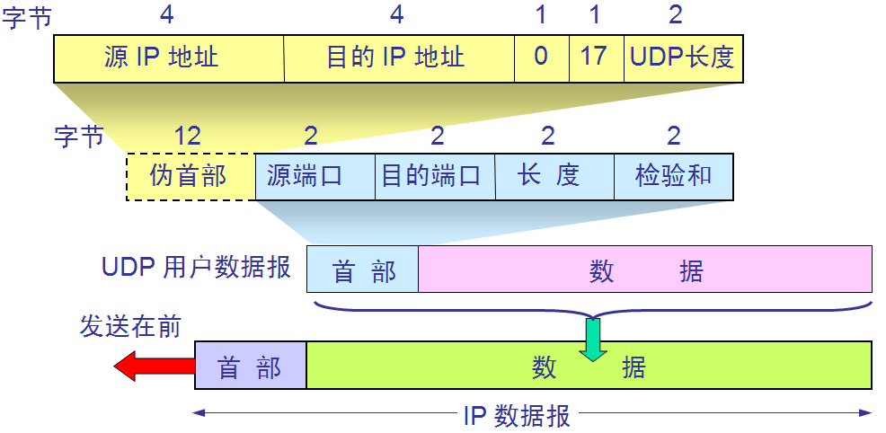

[TOC]
# 1.网络基础
## 1.1.TCP协议
### 1.1.1.三次握手
- **过程**
1. 客户端——发送带有SYN标志的数据包——服务端 一次握手 Client进入syn_sent状态
2. 服务端——发送带有SYN/ACK标志的数据包——客户端 二次握手 服务端进入syn_rcvd
3. 客户端——发送带有ACK标志的数据包——服务端 三次握手 连接就进入Established状态
- **为什么三次?​**

	主要是为了建立可靠的通信信道，保证客户端与服务端同时具备发送、接收数据的能力
- **为什么两次不行？**
1. 防止已失效的请求报文又传送到了服务端，建立了多余的链接，浪费资源
2. 两次握手只能保证单向连接是畅通的。（为了实现可靠数据传输， TCP 协议的通信双方， 都必须维 护一个序列号， 以标识发送出去的数据包中， 哪些是已经被对方收到的。 三次握手的过程即是通信双方 相互告知序列号起始值， 并确认对方已经收到了序列号起始值的必经步骤；如果只是两次握手， 至多只有连接发起方的起始序列号能被确认， 另一方选择的序列号则得不到确认）

### 1.1.2.四次挥手
- **过程**
1. 客户端——发送带有FIN标志的数据包——服务端，关闭与服务端的连接 ，客户端进入FIN-WAIT-1状态
2. 服务端收到这个 FIN，它发回⼀ 个 ACK，确认序号为收到的序号加1，服务端就进入了CLOSE-WAIT状态
3. 服务端——发送⼀个FIN数据包——客户端，关闭与客户端的连接，客户端就进入FIN-WAIT-2状态
4. 客户端收到这个 FIN，发回 ACK 报⽂确认，并将确认序号设置为收到序号加1，TIME-WAIT状态

- **为什么四次？**

	因为需要确保客户端与服务端的数据能够完成传输。
	CLOSE-WAIT: 这种状态的含义其实是表示在等待关闭
	TIME-WAIT: 为了解决网络的丢包和网络不稳定所带来的其他问题，确保连接方能在时间范围内，关闭自己的连接

- **如何查看TIME-WAIT状态的链接数量？**

	netstat -an |grep TIME_WAIT|wc -l 查看连接数等待time_wait状态连接数

- **为什么会TIME-WAIT过多？解决方法是怎样的？**

	可能原因： 高并发短连接的TCP服务器上，当服务器处理完请求后立刻按照主动正常关闭连接
	解决：负载均衡服务器；Web服务器首先关闭来自负载均衡服务器的连接

### 1.1.3.OSI与TCP/IP模型
OSI七层：物理层、数据链路层、网络层、传输层、会话层、表示层、应用层
TCP/IP五层：物理层、数据链路层、网络层、传输层、应用层
### 1.1.4.常见网络服务分层
应用层：HTTP、SMTP、DNS、FTP
​传输层：TCP 、UDP
​网络层：ICMP 、IP、路由器、防火墙
​数据链路层：网卡、网桥、交换机
​物理层：中继器、集线器
### 1.1.5.TCP与UDP区别及场景
类型|特点|性能|应用过场景|首部字节
---|:--:|---:|---:|---:
TCP|面向连接、可靠、字节流|传输效率慢、所需资源多|文件、邮件传输|20-60
UDP|无连接、不可靠、数据报文段|传输效率快、所需资源少|语音、视频、直播|8个字节
基于TCP的协议：HTTP、FTP、SMTP
​基于UDP的协议：RIP、DNS、SNMP
### 1.1.6.TCP滑动窗口，拥塞控制
**TCP通过**：应用数据分割、对数据包进行编号、校验和、流量控制、拥塞控制、超时重传等措施保证数据的可靠传输；
​**拥塞控制目的**：为了防止过多的数据注入到网络中，避免网络中的路由器、链路过载
​**拥塞控制过程**：TCP维护一个拥塞窗口，该窗口随着网络拥塞程度动态变化，通过慢开始、拥塞避免等算法减少网络拥塞的发生。
### 1.1.7.TCP粘包原因和解决方法
**TCP粘包是指：** 发送方发送的若干包数据到接收方接收时粘成一包
​**发送方原因：**
​TCP默认使用Nagle算法（主要作用：减少网络中报文段的数量）
​收集多个小分组，在一个确认到来时一起发送、导致发送方可能会出现粘包问题
​**接收方原因：**
​TCP将接收到的数据包保存在接收缓存里，如果TCP接收数据包到缓存的速度大于应用程序从缓存中读取数据包的速度，多个包就会被缓存，应用程序就有可能读取到多个首尾相接粘到一起的包。
**解决粘包问题:**

最本质原因在与接收对等方无法分辨消息与消息之间的边界在哪，通过使用某种方案给出边界，例如：
- 发送定长包。每个消息的大小都是一样的，接收方只要累计接收数据，直到数据等于一个定长的数值就将它作为一个消息。
- 包尾加上\r\n标记。FTP协议正是这么做的。但问题在于如果数据正文中也含有\r\n，则会误判为消息的边界。
- 包头加上包体长度。包头是定长的4个字节，说明了包体的长度。接收对等方先接收包体长度，依据包体长度来接收包体。

### 1.1.8.TCP、UDP报文格式
**TCP报文格式：**

**源端口号和目的端口号：**
​ 用于寻找发端和收端应用进程。这两个值加上ip首部源端ip地址和目的端ip地址唯一确定一个tcp连接。
​
**序号字段：**

​ 序号用来标识从TCP发端向TCP收端发送的数据字节流，它表示在这个报文段中的的第一个数据字节。如果将字节流看作在两个应用程序间的单向流动，则 TCP用序号对每个字节进行计数。序号是32 bit的无符号数，序号到达 2^32-1后又从0开始。

　　当建立一个新的连接时，SYN标志变1。序号字段包含由这个主机选择的该连接的初始序号ISN（Initial Sequence Number）。该主机要发送数据的第一个字节序号为这个ISN加1，因为SYN标志消耗了一个序号

**​ 确认序号：**
​ 既然每个传输的字节都被计数，确认序号包含发送确认的一端所期望收到的下一个序号。因此，确认序号应当是上次已成功收到数据字节序号加 1。只有ACK标志为 1时确认序号字段才有效。发送ACK无需任何代价，因为 32 bit的确认序号字段和ACK标志一样，总是TCP首部的一部分。因此，我们看到一旦一个连接建立起来，这个字段总是被设置， ACK标志也总是被设置为1。TCP为应用层提供全双工服务。这意味数据能在两个方向上独立地进行传输。因此，连接的每一端必须保持每个方向上的传输数据序号。

**​ 首都长度：**

​ 首部长度给出首部中 32 bit字的数目。需要这个值是因为任选字段的长度是可变的。这个字段占4 bit，因此TCP最多有6 0字节的首部。然而，没有任选字段，正常的长度是 2 0字节。

**​ 标志字段：**
在TCP首部中有 6个标志比特。它们中的多个可同时被设置为1.
　　URG紧急指针（u rgent pointer）有效
　　ACK确认序号有效。
　　PSH接收方应该尽快将这个报文段交给应用层。
　　RST重建连接。
　　SYN同步序号用来发起一个连接。
　　FIN发端完成发送任务。

**​ 窗口大小：**
​ TCP的流量控制由连接的每一端通过声明的窗口大小来提供。窗口大小为字节数，起始于确认序号字段指明的值，这个值是接收端期望接收的字节。窗口大小是一个 16 bit字段，因而窗口大小最大为 65535字节。

**​ 检验和：**
​ 检验和覆盖了整个的 TCP报文段：TCP首部和TCP数据。这是一个强制性的字段，一定是由发端计算和存储，并由收端进行验证。

**​ 紧急指针：**
​ 只有当URG标志置1时紧急指针才有效。紧急指针是一个正的偏移量，和序号字段中的值相加表示紧急数据最后一个字节的序号。 TCP的紧急方式是发送端向另一端发送紧急数据的一种方式。

**​ 选项：**
​ 最常见的可选字段是最长报文大小，又称为 MSS (Maximum Segment Size)。每个连接方通常都在通信的第一个报文段（为建立连接而设置 SYN标志的那个段）中指明这个选项。它指明本端所能接收的最大长度的报文段。

**UDP报文格式：**

**端口号：**
用来表示发送和接受进程。由于 IP层已经把I P数据报分配给TCP或UDP（根据IP首部中协议字段值），因此TCP端口号由TCP来查看，而UDP端口号由UDP来查看。TCP端口号与UDP端口号是相互独立的。
**长度：**
​ UDP长度字段指的是UDP首部和UDP数据的字节长度。该字段的最小值为 8字节（发送一份0字节的UDP数据报是 O K）。

**​ 检验和：**
​ UDP检验和是一个端到端的检验和。它由发送端计算，然后由接收端验证。其目的是为了发现UDP首部和数据在发送端到接收端之间发生的任何改动。

## 1.2.HTTP协议
### 1.2.1.HTTP协议1.0_1.1_2.0
