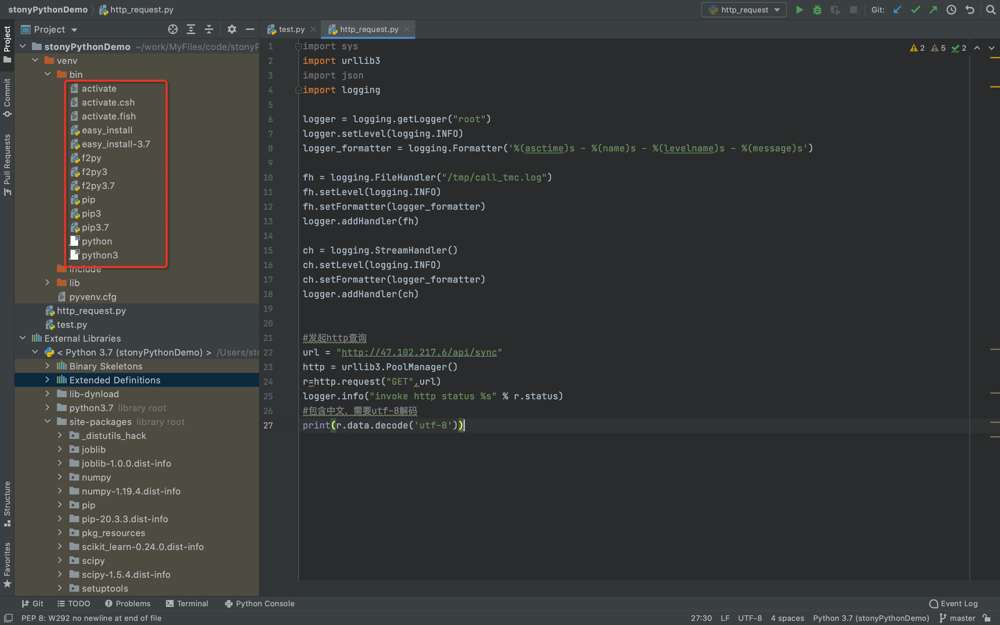

## python是什么
解释型执行语言，运行环境需要安装对应的解释器
python目前有python2和python3不同的版本，建议使用python3

## python安装
mac系统下自带python2.7和python3解释器，可以文本编辑python代码后，直接运行;
- python2.7安装目录
/System/Library/Frameworks/Python.framework/Versions/2.7
- python3安装目录
/Library/Developer/CommandLineTools/Library/Frameworks/Python3.framework/Versions/3.7

其他系统可到python官网下载对应python版本即可

## pip
- 什么是pip
python模块管理器，可以同java后端做个类比，jvm提供字节码的运行环境，maven负责管理java代码的依赖包；同样，python3解释器负责执行python3版本语法的代码，pip负责管理python代码依赖的module;
只有运行环境中存在对应的module，代码才能正常运行;
- pip的安装
一般高版本的python3自带安装pip
- pip命令
```
#安装模块
pip install <module_name>
#查看已安装的模块
pip list
```

## python开发ide
- 推荐使用<font color=#ff0000 size=4>pyCharm</font>
- 作为一款强大的python开发IDE,在创建项目时可以选择python解释器版本(python2或python3)，然后IDE会帮你创建一个虚拟的python环境(如下图的venv/bin目录下命令)，包括python解释器、依赖包管理器pip，可以用该项目空间下的pip下载你需要的依赖包等等;

